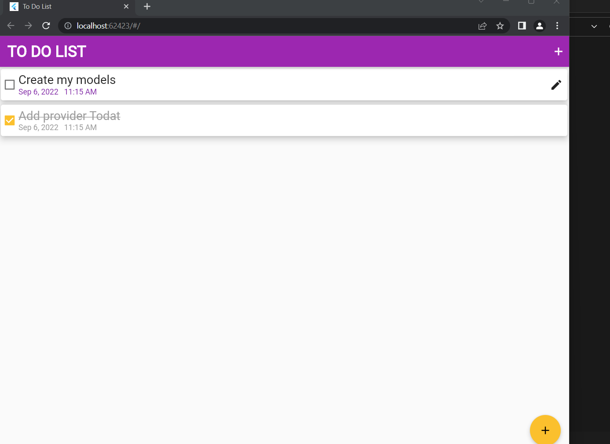
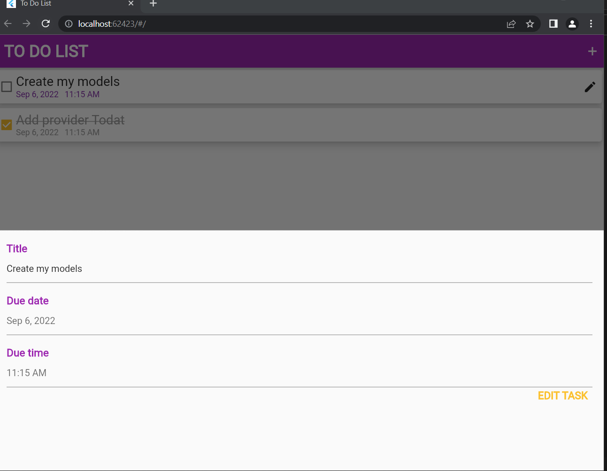
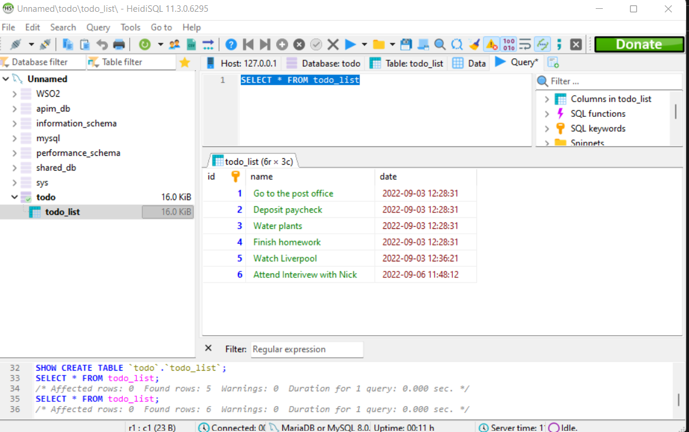
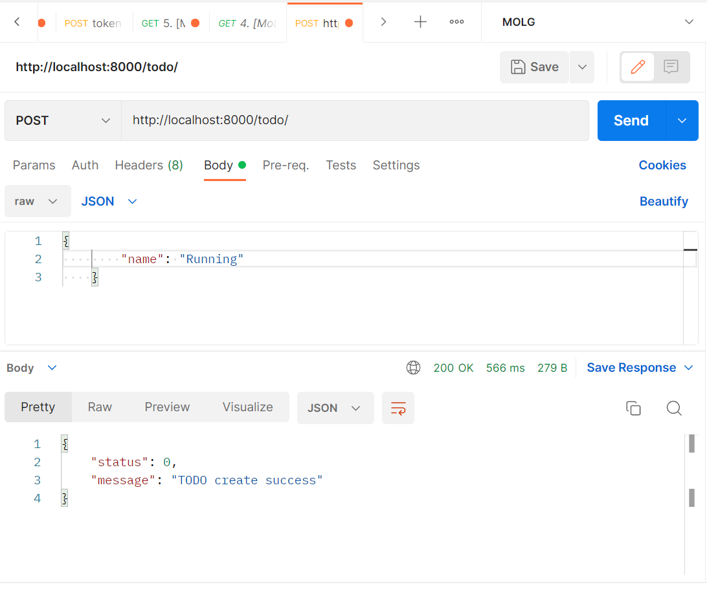
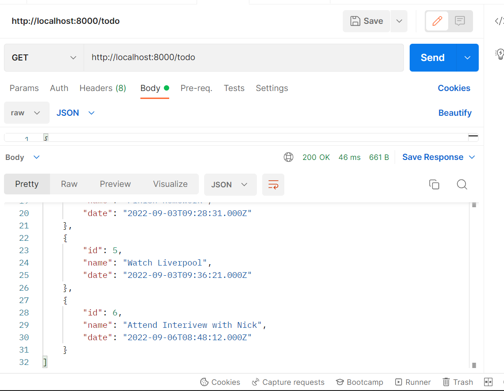
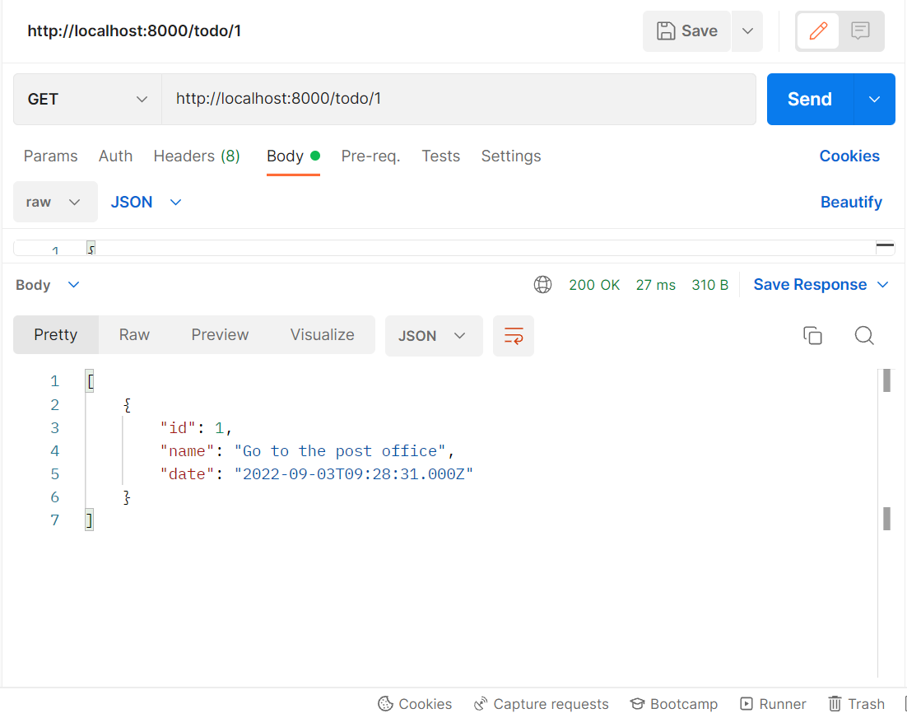
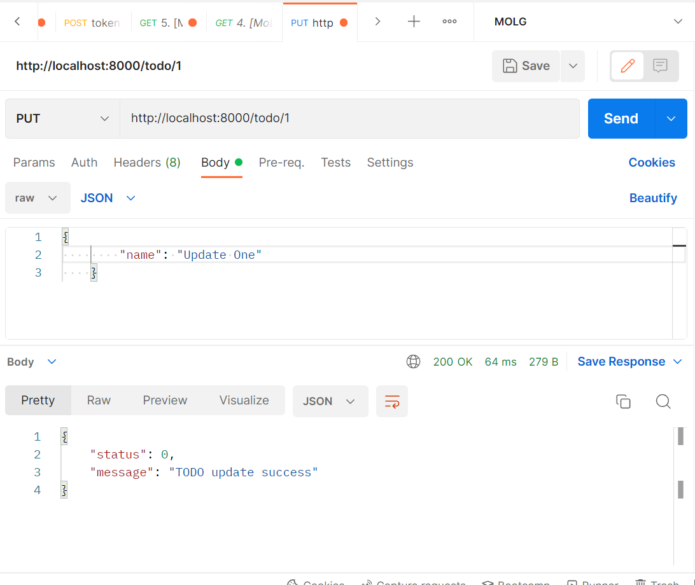

# NICK SCHOOLINH

This application has been designed to allow one to create an api of todo tasks and also consume them on the application.

## TO RUN THIS APPLICATION LOCALLY


```bash 
git clone https://github.com/Atwinenickson/TODOLIST
```

### INSTALL THE NODE JS API
```bash
yarn
```

```bash 
node app.js
```
### RUN THIS COMMAND AND ENSURE ALL PREREQUISITES ARE SET FOR THE APPLICATION
```bash
flutter doctor
```

### RUN APP
```bash 
cd FLUTTER/flutter_todo_app
flutter run
```
### Overview app


### Add Task App


### View database layout


### Add task api


### Get tasks


### Get single task


### Update Task

